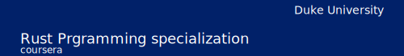

# 

# Rust development environment setup

_Rust Bootcamp week 1: Setting up your development environment_

This week, you will learn how to optimize your Rust development workflow using powerful tools such as programming suggestions, prompts with Copilot, and GitHub Codespaces. By diving into the lessons on programming with suggestions, using prompts with Copilot, and exploring the fundamentals of Codespaces, you will acquire the skills to streamline your coding process and collaborate more efficiently with others.

This is the first week of the Rust Bootcamp. There are 4 weeks in total:

- [week 1](https://github.com/alfredodeza/rust-setup) 👈 You are here!
- [week 2](https://github.com/alfredodeza/rust-fundamentals)
- [week 3](https://github.com/alfredodeza/rust-structs-types-enums/)
- [week 4](https://github.com/alfredodeza/applied-rust)

💡 Are you just looking for a 👉 [Rust template](https://github.com/alfredodeza/rust-template) to get started easily with a project? The [template](https://github.com/alfredodeza/rust-template) has everything you need!

## Is Rust difficult to learn?
Contrary to what some think, Rust is not actually more difficult to learn than other languages including Python and TypeScript. In fact, [Google gathered data from its own engineers to understand how difficult it is to learn Rust](https://opensource.googleblog.com/2023/06/rust-fact-vs-fiction-5-insights-from-googles-rust-journey-2022.html). The final report found that most engineers felt proficient in Rust in 2 months or less, where some would feel proficient in as little as 3 weeks! 

🚀 **Watch the Video course**

## Contents
This week has several references to supporting content that can help you setup your environment. Make sure you have Rust installed and you are using [Visual Studio Code](https://code.visualstudio.com/?WT.mc_id=academic-0000-alfredodeza).

This repository is [Codespaces](https://docs.github.com/en/codespaces/overview) *ready*, and it is set as a template repository. You can create a new repository from this template and start working on your own with Codespaces. This means that Rust, Copilot, and all the extensions are already installed and configured for you.

:fire: If you need a quick reference for Codespaces and configuration with Visual Studio Code, feel free to reuse the [configuration files](./.devcontainer) in this repository.

### Lesson 1: Setting up your text editor
- [Rust on Visual Studio Code](https://code.visualstudio.com/docs/languages/rust?WT.mc_id=academic-0000-alfredodeza)
- [Install Rust on Windows](https://learn.microsoft.com/windows/dev-environment/rust/setup?WT.mc_id=academic-0000-alfredodeza)
- [RustUp the toolchaing installer](https://rustup.rs/)
- [Rust Analyzer extension](https://marketplace.visualstudio.com/items?itemName=rust-lang.rust-analyzer&WT.mc_id=academic-0000-alfredodeza)

Assignment: [Setting-up-your-text-editor](./lab.md#assignment-1-install-rust-with-visual-studio-code)

### Lesson 2: Using AI pair-programming
- [GitHub Copilot](https://docs.github.com/en/copilot/quickstart)
- [Copilot for Students and Educators](https://aka.ms/Copilot4Students)
- [Introduction to GitHub Copilot](https://learn.microsoft.com/training/modules/introduction-to-github-copilot/?WT.mc_id=academic-0000-alfredodeza)

Assignment: [Enable GitHub Copilot](./lab.md#Assignment-2-Enable-GitHub-Copilot)

### Lesson 3: Codespaces for Rust
- [Introduction to Codespaces](https://learn.microsoft.com/training/modules/work-azure-repos-github/6-develop-online-github-codespaces?WT.mc_id=academic-0000-alfredodeza)
- [Codespaces for students](https://techcommunity.microsoft.com/t5/educator-developer-blog/what-is-github-codespaces-and-how-can-students-access-it-for/ba-p/3676103?WT.mc_id=academic-0000-alfredodeza)
- [Managing quotas](https://techcommunity.microsoft.com/t5/educator-developer-blog/how-to-optimize-your-codespaces-pro-tips-for-managing-quotas/ba-p/3712032?WT.mc_id=academic-0000-alfredodeza)

### Lesson 4: Practice Lab

Use the [included lab](./lab.md) for this week to apply the concepts you've learned. The [lab](./lab.md) lab has 3 parts that are all relevant for what you've learned this week.

## Resources

- [Rust Book](https://doc.rust-lang.org/book/)
- [First steps with Rust Learning Path](https://learn.microsoft.com/training/paths/rust-first-steps/?WT.mc_id=academic-0000-alfredodeza)
- [DevOps command-line tools in Python and Rust](https://learning.oreilly.com/videos/devops-command-line-tools/28037639VIDEOPAIML/)

**Coursera Courses**

- [MLOps Machine Learning Operations Specialization](https://www.coursera.org/specializations/mlops-machine-learning-duke)
- [Linux and Bash for Data Engineering](https://www.coursera.org/learn/linux-and-bash-for-data-engineering-duke)
- [Open Source Platforms for MLOps](https://www.coursera.org/learn/open-source-platforms-duke)
- [Python Essentials for MLOps](https://www.coursera.org/learn/python-essentials-mlops-duke)
- [Web Applications and Command-Line tools for Data Engineering](https://www.coursera.org/learn/web-app-command-line-tools-for-data-engineering-duke)
- [Python and Pandas for Data Engineering](https://www.coursera.org/learn/python-and-pandas-for-data-engineering-duke)
- [Scripting with Python and SQL for Data Engineering](https://www.coursera.org/learn/scripting-with-python-sql-for-data-engineering-duke)
